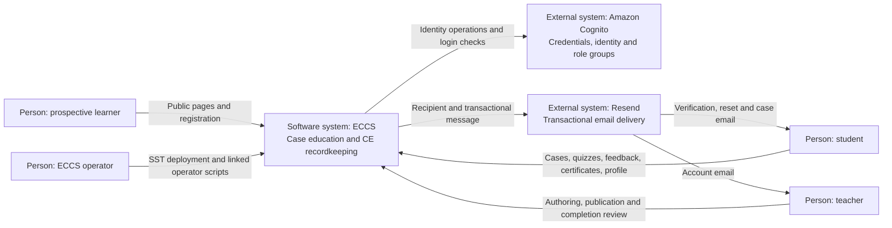
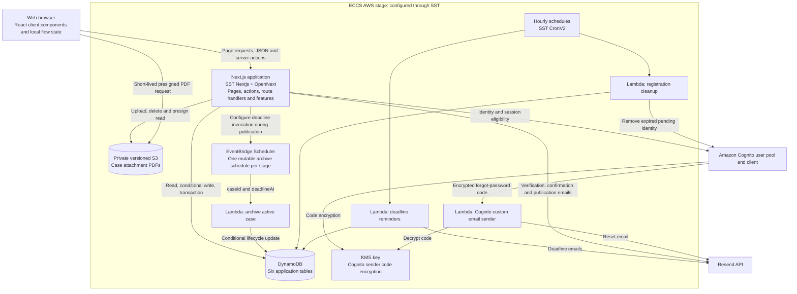
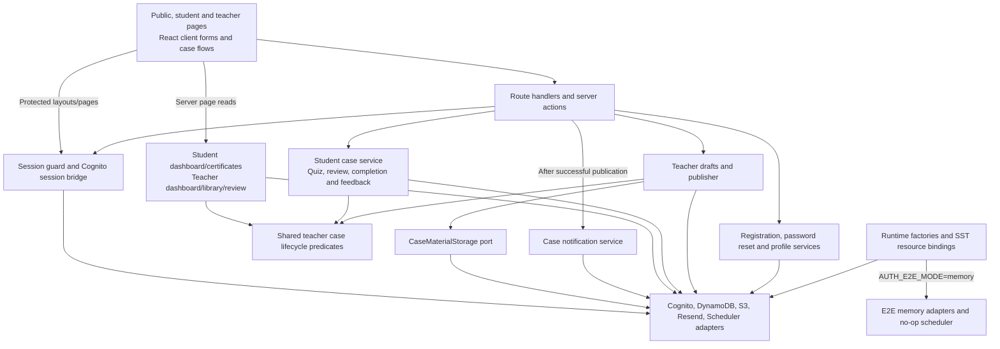

# ECCS Current Architecture Blueprint

Generated: 2026-09-15. Repository baseline: `ec55ca5b990d7f71d393b54f7b79be278ac390ee`.

## 1. Scope and evidence

This document describes the checked-in ECCS implementation: a full-stack TypeScript/Node.js application, its infrastructure definitions, supporting scripts, and tests. It uses C4 context, container, and component views. It includes existing implementation patterns and accepted decisions; it contains no future architecture or development roadmap.

Evidence was drawn from `AGENTS.md`, `PRD.md`, `DESIGN.md`, `.env.sample`, all nine ADRs indexed by `docs/adr/README.md`, and the source, tests, scripts, package configuration, and deployment definitions cited below. Citations are repository-relative paths; `:number` identifies a useful starting line. Environment values and live accounts were not inspected.

Evidence terminology throughout:

- **Implemented:** directly visible in application source. A cited test describes checked-in coverage, not a test execution performed for this document.
- **Configured:** declared by executable infrastructure or package configuration. Actual deployed state and provider defaults were not independently verified.
- **Documented intent:** a statement from a PRD, ADR, runbook, or repository instruction; it does not establish runtime behavior.
- **Inference:** an interpretation of the cited implementation, explicitly identified when material.
- **Unknown/not evidenced:** the inspected repository does not establish the behavior.

No application, infrastructure, or browser tests were run for this documentation task. No claim here establishes the current state of an AWS account, Resend account, GitHub environment, or deployed release.

## 2. Architectural overview

ECCS is a feature-oriented Next.js modular monolith. Public pages, student and teacher interfaces, HTTP route handlers, server actions, and most business behavior share one application package and one SST Next.js deployment component. Separate Lambda entry points perform registration cleanup, deadline reminders, deadline archival, and Cognito-triggered password-reset email delivery. These jobs reuse the same repository's feature and integration code; they are not independently owned product services. Evidence: `package.json`, `src/app/`, `src/features/`, `infra/nextjs-client.ts`, `infra/jobs.ts`, `infra/case-archive.ts`, `infra/auth.ts`.

The code combines feature-based organization with selective ports and adapters. Authentication and notification services define external capabilities and receive implementations through constructors. Other features place repository interfaces, business operations, runtime factories, DynamoDB adapters, and memory adapters in the same server-only module. Consequently, this is a pragmatic modular monolith, not a uniformly separated domain/application/infrastructure layering scheme. Evidence: `src/features/auth/registration/service.ts`, `src/features/auth/registration/server.ts`, `src/features/student/cases/student-case.ts`, `src/features/teacher/case-authoring/publishing.ts`.

The product scope is one tenant and one teacher persona. Roles are `student` and `teacher`; teacher bootstrap is an operator script, and no super-admin UI or payment-provider integration is implemented. Teacher case overview queries span the shared content library, while draft mutations and detailed completion review also check teacher ownership. Evidence: `PRD.md`, `src/lib/auth/roles.ts`, `scripts/bootstrap-admin-teacher.ts`, `src/features/teacher/dashboard/cases.ts`, `src/features/teacher/case-library/cases.ts`, `src/features/teacher/case-review/case-review.ts`.

Relevant accepted decisions: [ADR 0001](adr/0001-use-a-feature-oriented-nextjs-modular-monolith.md), [ADR 0002](adr/0002-use-sst-ion-for-aws-serverless-deployment.md), and [ADR 0006](adr/0006-use-ports-and-adapters-with-an-isolated-e2e-runtime.md).

## 3. C4 views

The diagrams use Mermaid flowchart syntax to express C4 levels. Arrows show actual calls or data movement; infrastructure nodes describe configured deployment components, not an observed live environment.

### 3.1 System context

The partner medical facility is a documented CE authority in `PRD.md`; no partner-operated application or partner integration is evidenced. DynamoDB and S3 appear inside the ECCS deployment boundary in the container view because they store ECCS application data. Cognito and Resend are managed external identity/delivery systems.

### 3.2 Container view

Sources: `sst.config.ts`, `infra/auth.ts`, `infra/tables.ts`, `infra/case-materials.ts`, `infra/case-archive.ts`, `infra/jobs.ts`, `infra/nextjs-client.ts`. The SST Next.js component abstracts its hosting resources. This repository does not explicitly define an API Gateway, container service, separate API deployment, or queue between publication and email delivery.

### 3.3 Next.js component view

The adapters box is a compact grouping, not a central dispatcher. Each runtime factory selects its own dependencies; memory mode supplies equivalent capability implementations where implemented. `src/lib/aws/dynamodb.ts` and `src/lib/aws/cognito.ts` implement several feature-owned interfaces. Student features import teacher lifecycle helpers, and teacher review imports the shared completion IDs and feedback model. These are direct code dependencies, not network boundaries.

## 4. Repository, runtime, and frontend structure

| Area | Current responsibility and evidence |
| --- | --- |
| `src/app/` | App Router pages, role layouts, public verification routes, JSON APIs, attachment and certificate downloads, E2E helper routes. |
| `src/features/auth/` | Registration, login contracts/UI, password reset, account menu and logout. The active login UI uses the custom Better Auth endpoints. |
| `src/features/profile-security/` | Shared name/email/password workflows and forms; student and teacher wrappers supply authenticated profiles. |
| `src/features/teacher/` | Draft authoring/publishing, lifecycle, archival, dashboard, library and learner completion review. |
| `src/features/student/` | Dashboard/certificate queries, browser case flow, quiz/feedback operations, certificate preview and PDF rendering. |
| `src/features/case-materials/` | Object storage port, PDF byte conversion, attachment lifecycle and S3/memory adapters. |
| `src/features/case-notifications/` | Recipient policy, notification ports, deadline selection, repository adapters and reminder Lambda composition. |
| `src/features/case-feedback/`, `src/features/student-case-records/` | Shared feedback validation and deterministic student/case IDs. |
| `src/lib/auth/`, `src/lib/aws/` | Session integration, role helpers, Cognito token verification, shared AWS/email adapters and resource resolution. |
| `src/lib/e2e/` | Shared test state, identity/repository/email doubles, helper-route guard and test fixtures. |
| `src/functions/auth/` | Cognito custom email sender Lambda. |
| `src/components/`, `public/` | Shared interface primitives, notification context, navigation and static assets. |
| `infra/`, `scripts/` | SST deployment composition and linked operational scripts. |
| `tests/e2e/`, colocated `*.test.ts(x)` | Browser suites and Vitest unit/component/adapter tests. |

[`package.json`](../package.json) records the exact pinned versions of Bun, Next.js, React, TypeScript, SST, Better Auth, AWS SDK clients, Resend, Tailwind, Vitest, Vite and Playwright. `bun.lock` records dependency resolution; [dependency maintenance notes](./dependency-maintenance.md) explain transitive overrides and deferred major upgrades. `README.md`, `.node-version`, and `.nvmrc` identify Node 24 for the toolchain. Bun is the project command/package runtime; individual Lambda runtime versions are not explicitly set in the inspected component definitions.

The normal local script enters SST stage `ailocal`; the SST Next.js component starts the child app on port 3001. The production build script selects Next.js webpack. Vite supports Vitest tooling; it is not the production application server. TypeScript is strict, uses bundler module resolution, and maps `@/*` to `src/*`. ESLint applies Next.js core-web-vitals and TypeScript presets. Evidence: `package.json`, `tsconfig.json`, `vitest.config.ts`, `eslint.config.mjs`, `infra/nextjs-client.ts:60`.

Server components perform page reads and pass explicit view models to client components. Client components use React state, effects, and action state for forms, wizard sections, quiz choices, and notifications. No separate Redux-style store or client query-cache dependency is declared. The shared notification provider sits in `src/app/layout.tsx`; global styles use Tailwind and the design palette. Nunito Sans is configured through `next/font/google`. Evidence: `src/app/layout.tsx`, `src/app/globals.css`, `src/features/student/cases/student-case-flow.tsx`, `src/features/teacher/case-authoring/case-authoring-wizard.tsx`, `src/features/profile-security/profile-security-forms.tsx`.

Student and teacher layouts declare `force-dynamic`. Mutating student actions use `revalidatePath` for affected dashboard, certificate, and teacher views. The authored draft and unfinished learner response remain browser component state until explicit submission. No server-side recoverable learner draft, browser-storage progress persistence, or general application data cache is evidenced in these flows. Better Auth's cookie cache is separate from product data caching.

## 5. Entry points and dependency boundaries

### 5.1 Route inventory

Route groups in parentheses do not form part of the URL.

| URL or route family | Entry point and delegation |
| --- | --- |
| `/`, `/faculty` | Public marketing server pages under `src/app/(public)/`. Public navigation can use the optional application session. |
| `/register`, `/login`, `/forgot-password`, `/reset-password` | Public pages render feature-owned forms. Registration/reset use server actions; the active login form calls the Cognito bridge endpoints. |
| `/verify-email`, `/verify-email-change` | Public GET handlers consume workflow tokens and redirect to fixed login/profile destinations. |
| `/student`, `/student/profile`, `/student/certificates` | Student layout and page-level session checks; dashboard/history queries or shared profile actions. |
| `/student/cases/[caseId]` | Loads the active-case presentation and renders `StudentCaseFlow` with quiz, review and feedback server actions. |
| `/student/cases/[caseId]/attachments/[attachmentId]` | Student session, signed application URL, active-case attachment lookup, then redirect to a storage read URL. |
| `/student/certificates/[certificateId]/download` | Student session, owner-scoped certificate lookup, on-demand PDF response. |
| `/teacher`, `/teacher/profile`, `/teacher/cases` | Teacher layout, dashboard/library reads and shared profile actions. |
| `/teacher/cases/new`, `/teacher/cases/[caseId]/edit` | Client authoring wizard loads/saves drafts through the draft API. |
| `/teacher/cases/[caseId]`, `/teacher/cases/[caseId]/students/[studentProfileId]` | Teacher feature authorizes case review, then reads completions and final analysis/feedback. |
| `/api/teacher/case-draft` | GET retrieves one/all owned drafts; PUT validates and saves; DELETE deletes an owned draft. |
| `/api/teacher/case-publish` | POST validates/publishes through `TeacherCasePublisher`, then attempts publication email. |
| `/api/auth/[...all]` | Better Auth GET/POST handler, including custom `/cognito/sign-in`, `/cognito/complete-new-password`, session and sign-out behavior. |
| `/api/e2e/*` | Memory-mode test state, email-link lookup, fixture seeding and material serving. See testing section. |

Sources: `src/app/`; representative implementations: `src/app/api/teacher/case-draft/route.ts`, `src/app/api/teacher/case-publish/route.ts`, `src/features/student/cases/actions.ts`, `src/app/api/auth/[...all]/route.ts`.

No application `middleware.ts` or `proxy.ts` is present in the inspected source. Role enforcement occurs through layouts, page/route calls and server-action guards rather than a repository-defined middleware layer. The custom route handlers return JSON, redirects, or binary content; no explicit public API versioning scheme is present.

### 5.2 Direction of calls

The common direction is browser/page → entry point → feature operation → capability/repository → provider. Server-only markers protect integration modules from client imports. `"use server"` marks callable mutations. Shared profile helpers trust the authenticated profile supplied by the student/teacher wrappers; repository interfaces accept IDs rather than an implicit request principal. Evidence: `src/features/student/profile-security/actions.ts`, `src/features/teacher/profile-security/actions.ts`, `src/features/profile-security/actions.ts`, `src/features/student/cases/actions.ts`.

Authorization is not uniformly repeated in every layer. Teacher review and library feature functions call session guards internally; teacher dashboard and several student repository functions rely on their page/action callers. Draft repositories check owner and draft lifecycle. Certificate reads verify the stored owner. Teacher dashboard and archived-library queries are not partitioned by teacher. Detailed teacher review accepts records owned by the caller, and also records without a teacher owner. This matches the shared-library scope in the PRD, while showing why these modules are not independent tenant boundaries. Evidence: `src/features/teacher/case-review/case-review.ts:65`, `:243`, `src/features/teacher/case-library/cases.ts:36`, `src/features/teacher/dashboard/cases.ts:36`, `src/features/student/dashboard/summary.ts`, `src/features/teacher/case-authoring/drafts.ts`.

Cross-feature dependencies are deliberate and visible: student reads and notifications consume teacher case records; teacher review consumes student completions; all authentication workflows share identity/profile adapters. Some `lib` adapters import feature-owned interfaces, while feature composition imports those adapters. This is dependency inversion at selected interfaces, not a universal prohibition on `lib`→`features` imports. No exhaustive circular-import analysis was performed, and no custom import-boundary lint rule is configured in `eslint.config.mjs`.

### 5.3 Ports, adapters and bindings

| Capability | Port and runtime composition | Production adapter |
| --- | --- | --- |
| Registration | `src/features/auth/registration/service.ts`, `repository.ts`, `identity.ts`, `email.ts`; composed by `server.ts` | `CognitoAuthAdapter`, `DynamoAuthRepository`, `ResendRegistrationEmailSender` |
| Password reset and profile changes | Feature service interfaces and `server.ts` factories | Shared Cognito/DynamoDB/email classes implement multiple feature interfaces |
| Session creation | `src/lib/auth/cognito-session-bridge.ts`; composed in `auth.ts` | Cognito adapter, AWS ID-token verifier, profile repository, Better Auth internal adapter |
| Draft/publish/student records | Interfaces and factories colocated in `drafts.ts`, `publishing.ts`, `student-case.ts` | Feature-local DynamoDB document-client implementations |
| Materials | `CaseMaterialStorage` in `src/features/case-materials/storage.ts` | `S3CaseMaterialStorage` |
| Notifications | Repository and email interfaces in `src/features/case-notifications/service.ts` | `DynamoCaseLifecycleNotificationRepository` and Resend sender |
| Archive scheduling | `ActiveCaseArchiveScheduler` | `EventBridgeActiveCaseArchiveScheduler`; no-op factory selection in memory mode |

Factories resolve linked resource IDs/names/secrets through `Resource` from SST in `src/lib/aws/resources.ts`. Missing required production bindings throw. Raw Scheduler resources are an explicit exception: their schedule name/group, target ARN and invocation-role ARN arrive through deployment-set environment variables. Services use constructor injection, optional clocks, and injectable document clients; no dependency-injection container or runtime plugin discovery registry is evidenced. `getAuth()` is a lazy process singleton, E2E adapters are shared, and several provider clients are constructed by feature factories.

## 6. Authentication, identity and account flows

Accepted decisions: [ADR 0003](adr/0003-use-cognito-backed-identities-with-better-auth-sessions.md), [ADR 0006](adr/0006-use-ports-and-adapters-with-an-isolated-e2e-runtime.md), [ADR 0008](adr/0008-use-resend-for-transactional-email.md).

### 6.1 Registration and verification

Registration parses and normalizes input, creates an administrative Cognito identity with provider email delivery suppressed, sets its permanent password, and disables it pending application verification. DynamoDB stores the pending workflow, including Cognito subject, normalized email, names, hashed verification tokens, send count and expiry. A Resend email carries the verification link. Evidence: `src/features/auth/registration/service.ts`, `src/lib/aws/cognito.ts:67`, `src/features/auth/registration/repository.ts:5`.

Tokens contain 32 random bytes; the repository stores SHA-256 hashes. The default expiry is 24 hours, with a maximum of three sends during the original window. Resends preserve earlier hashes and do not extend expiry. The current hash is indexed; older valid hashes are found through a fallback scan. Conditional writes enforce pending-email creation, resend count and one-time consumption. Evidence: `src/features/auth/registration/tokens.ts`, `src/features/auth/registration/service.ts:61`, `src/lib/aws/dynamodb.ts:56`, `:79`, `:128`, `:151`.

Verification validates the token/window, confirms and enables the Cognito identity, assigns the student group, writes the student profile, and consumes the workflow token. The handler sends the user to login without creating a session. These Cognito/DynamoDB steps are sequential, not one atomic transaction. Expired pending identities are cleaned by the scheduled cleanup service; failures can be recorded on workflow records. Evidence: `src/features/auth/registration/service.ts:218`, `src/app/(public)/verify-email/route.ts`, `src/features/auth/registration/cleanup.ts`.

### 6.2 Login and session loading

The active login form calls `/api/auth/cognito/sign-in`. A teacher with a temporary password receives a new-password challenge and completes it through `/api/auth/cognito/complete-new-password`. Before creating an application session, the bridge verifies the returned Cognito ID token against the configured pool/client and ID-token use, checks verified email, requires exactly one recognized role group, loads the profile by Cognito subject, and checks profile/email/role agreement. Evidence: `src/features/auth/login/login-form.tsx:157`, `src/lib/auth/cognito-session-bridge.ts:256`, `src/lib/auth/cognito-id-token-verifier.ts:23`, `src/lib/auth/cognito-groups.ts:26`.

Better Auth has no configured application database. Its custom bridge creates the application user/session through the internal adapter and writes a JWE cookie-backed session. The configured lifetime is eight hours with session and cookie-cache refresh disabled. Cookie settings include HTTP-only, root path, SameSite=Lax, and secure cookies in production. The repository configures trusted origins and the custom bridge checks Origin/Referer for login requests; its check accepts requests when both headers are absent. Evidence: `src/lib/auth/auth.ts:28`, `src/lib/auth/cognito-session-bridge.ts:311`, `:480`.

Each `getOptionalAppSession()` obtains the Better Auth session, reloads the profile, applies its invalidation timestamp/exempt-token rule, and checks current Cognito enabled status, email verification and membership in the profile's role group. An absent/wrong-role session redirects to `/login` through the role guards. Initial login rejects multiple recognized groups, whereas existing-session eligibility checks membership in the current profile role. Profile reads do not request DynamoDB strong consistency. Evidence: `src/lib/auth/session.ts:17`, `:48`, `:80`, `src/lib/aws/cognito.ts:266`, `src/lib/aws/dynamodb.ts:215`.

Logout posts to Better Auth's sign-out endpoint. The repository does not implement a persistent per-session logout revocation ledger. Application-wide account changes instead use the profile invalidation marker described below. `src/features/auth/login/actions.ts` and its `LoginService` still exist, but the browser login path that actually creates the cookie is the custom bridge. Evidence: `src/features/auth/account-menu.tsx:55`, `src/features/auth/logout/logout-button.tsx`, `src/features/auth/login/actions.ts`.

### 6.3 Account changes and password reset

- **Name:** shared profile service updates Cognito and then the DynamoDB profile. Previously issued certificate/completion display names are snapshots and are not rewritten.
- **Email:** a pending address and hashed token are stored; the old address remains active until verification. Verification defaults to 24 hours. It changes Cognito, signs out Cognito sessions, updates the profile and clears pending fields. Application sessions are invalidated, with a matching current profile/session token optionally exempted. The public verification handler reads the Better Auth session directly to determine that exemption.
- **Authenticated password change:** verifies the current password, sets the replacement in Cognito, globally signs out Cognito sessions, writes the profile invalidation timestamp with the current token exemption, then sends a confirmation email.
- **Forgotten-password reset:** uses Cognito `ForgotPassword` and `ConfirmForgotPassword`. The link contains the code but not the user's email; the user re-enters email at confirmation. After confirmation, the service signs out Cognito sessions, invalidates the matching student profile's application sessions, then emails confirmation. The repository lookup in this path filters to students, so equivalent teacher application-cookie invalidation is not established by this implementation.

Evidence: `src/features/profile-security/service.ts:168`, `:204`, `:263`, `:368`; `src/app/(public)/verify-email-change/route.ts:14`; `src/features/auth/password-reset/service.ts:119`, `:216`; `src/lib/aws/dynamodb.ts:229`, `:324`; `src/lib/aws/cognito.ts:306`, `:351`.

The production reset adapter translates Cognito rate-limit and invalid/expired-code errors. The precise five-per-hour counter exists in the memory identity implementation; the production code does not implement that application counter. The 60-minute value supplies reset-email copy, while actual production code validity is delegated to Cognito. Identity, profile, revocation and email operations are not a cross-provider transaction; later failures can occur after earlier mutations have completed.

## 7. Persistence and data ownership

Accepted decision: [ADR 0004](adr/0004-persist-application-records-in-access-pattern-specific-dynamodb-tables.md).

### 7.1 Tables and access patterns

All six tables are SST Dynamo components defined in `infra/tables.ts`. Declared global secondary indexes project all attributes. Application records use plain TypeScript shapes, record discriminators and mapping/validation helpers rather than an ORM or relational schema.

| Table | Primary key | Global secondary indexes | Stored facts and ownership |
| --- | --- | --- | --- |
| `RegistrationWorkflowTable` | `emailNormalized` | `VerificationTokenHashIndex`; `StatusExpiresAtIndex` (`status`, `expiresAt`) | Pending registration identity reference, names, token hashes, verification/resend/cleanup state; TTL on `ttl`. |
| `UserProfileTable` | `profileId` | `EmailIndex`; `RoleIndex`; `PendingEmailVerificationTokenHashIndex` | Cognito-subject-aligned profile, role mirror, names, verified/pending email, access flag, session invalidation state. |
| `TeacherCaseTable` | `caseId` | `LifecycleDeadlineIndex` (`lifecycle`, `deadlineAt`); `LifecycleArchivedIndex` (`lifecycle`, `archivedAt`) | Draft/published content, quiz answer key, attachment metadata/storage keys, lifecycle dates, teacher ID, completion/feedback counts, reminder marker; also the singleton active-case lock record. |
| `StudentCertificateTable` | `certificateId` | `StudentCompletedAtIndex` (`studentProfileId`, `completedAt`) | Owner, case reference/title, completion timestamp, display-name snapshot and ECCS branding. |
| `StudentCaseCompletionTable` | `completionId` | `CaseCompletedAtIndex`; `StudentCompletedAtIndex` | Case/student/certificate references, locked analysis and timestamps, display-name snapshot, optional feedback. |
| `StudentQuizAttemptTable` | `attemptId` | None | Current failure count since review, review-required flag and update time for a student/case pair. It is not a full attempt event log. |

Model evidence: `src/features/auth/registration/repository.ts`, `src/features/teacher/case-authoring/drafts.ts`, `src/features/teacher/case-authoring/publishing.ts`, `src/features/student/cases/student-case.ts:112`, `src/lib/e2e/in-memory-auth.ts:190`.

Student/case certificate, completion and attempt IDs derive from SHA-256 of the student ID and case ID, with different prefixes. This makes the identity of a student/case record deterministic; it is not a public certificate-verification signature. Certificates and completions retain separate copies of selected facts. There are no database foreign keys: relationships and joined views are implemented in services and queries. Evidence: `src/features/student-case-records/ids.ts`, `src/features/teacher/case-review/case-review.ts`.

### 7.2 Reads, consistency and boundaries

Dashboard queries use lifecycle/deadline indexes; student certificate lists use owner/time indexes; teacher completion review uses case/time indexes and deterministic completion lookup. Full histories and libraries use `queryAllDynamoItems`, while dashboard queries intentionally limit recent results. Registration lookup by older token hash uses `paginateScan`, so the ADR's statement about indexed access does not describe every read path. Evidence: `src/lib/aws/dynamodb-query-core.ts`, `src/lib/aws/dynamodb.ts:128`, `src/features/student/dashboard/summary.ts:201`, `src/features/teacher/case-library/cases.ts:70`, `src/features/teacher/case-review/case-review.ts:183`.

Strong reads are requested selectively, including pending-registration lookup and some post-conflict checks. Many direct reads and all GSI queries rely on their normal consistency behavior. Critical invariants use conditional writes or transactions rather than assuming a preceding query excludes concurrency. The same Next.js runtime is linked to every application table; end-user record ownership is enforced in application code, not by per-student IAM credentials.

Only the registration workflow table declares TTL. No application-level retention expiry is configured for certificate/completion records, no application deletion workflow for a student account is present, and certificate PDFs are generated rather than durably stored. S3 material retention is separate. Backup recovery, deployed encryption settings and long-term availability were not operationally inspected; `infra/tables.ts` does not explicitly configure customer-managed encryption keys or backup policies.

## 8. Case publication, learning and completion flows

Accepted decisions: [ADR 0001](adr/0001-use-a-feature-oriented-nextjs-modular-monolith.md), [ADR 0004](adr/0004-persist-application-records-in-access-pattern-specific-dynamodb-tables.md), [ADR 0007](adr/0007-use-deadline-derived-case-availability-with-scheduled-archival.md).

### 8.1 Draft authoring and publication

The authoring wizard keeps the editable draft, active section, dirty state and validation locally. It loads and explicitly saves through `/api/teacher/case-draft`; publish is presented in the review section. A title is the minimum save requirement. Publish validation requires the complete presentation, model answer, teaching resources/deadline and valid CME questions/options. Date conversion produces the end of the selected UAE calendar date. Uploaded attachment bytes are replaced with storage metadata before database persistence. Evidence: `src/features/teacher/case-authoring/case-authoring-wizard.tsx`, `src/features/teacher/case-authoring/schema.ts`, `src/features/teacher/case-authoring/drafts.ts`.

The production publisher first queries for an active case and resolves an owned draft if supplied. Its DynamoDB transaction then writes a singleton active-case lock only if absent or expired and writes/replaces the case under existence/owner/draft conditions. The lock is the write-time invariant preventing concurrent publication of multiple active cases; the initial GSI query alone is not that invariant. After committing, it creates or updates the archive schedule. On scheduling failure it attempts a conditional rollback and cleanup of newly uploaded objects, then reports an error. Evidence: `src/features/teacher/case-authoring/publishing.ts:59`, `:173`, `:193`, `:252`, `:318`.

The route attempts publication email after the publisher returns. It awaits that attempt but catches/logs errors and still returns a successful publication response. There is no message queue/outbox separating publication from this email attempt. Scheduler, DynamoDB and S3 changes are a sequence with compensation, not one distributed transaction. Evidence: `src/app/api/teacher/case-publish/route.ts:23`, `src/features/teacher/case-authoring/publishing.ts`.

Draft reads reject wrong owners and non-draft records. However, draft save/delete use an earlier owner/lifecycle check followed by an unconditional database write/delete. Unlike publication, these writes do not include a write-time lifecycle condition; concurrent save/delete versus publication is not protected by the same invariant. Evidence: `src/features/teacher/case-authoring/drafts.ts:201`, `:274`, `:295`.

### 8.2 Deadline and archival

`isActiveTeacherCase` requires lifecycle `published` and `deadlineAt >= now`; expired published records are read as archived once `deadlineAt < now`. Teacher history merges persisted archived records with expired published records. Therefore a late archive job need not leave the case available to students. At the exact stored deadline millisecond, the active predicate still returns true. Evidence: `src/features/teacher/cases/case-lifecycle.ts:13`, `src/features/teacher/case-library/cases.ts:70`.

The archive adapter manages one mutable, stage-named schedule in the default Scheduler group. It updates first and creates when not found; its one-time UTC expression rounds the deadline upward to the next whole second, disables the flexible window, and retains the schedule after completion. The invocation payload contains case ID and deadline. The archive function validates the event shape and conditionally changes only a matching published case/type/deadline; stale and already-archived events are no-ops. It does not compare the deadline to the current clock, so due-time invocation relies on Scheduler. An early invocation with the correct payload can archive that case. Evidence: `src/features/teacher/cases/active-case-archive-scheduler.ts:41`, `:65`, `src/features/teacher/cases/archive-active-case-job.ts:4`, `src/features/teacher/cases/archive-active-case.ts:66`, `infra/case-archive.ts:3`.

### 8.3 Learner flow and quiz

The browser flow is presentation → personal analysis → comparison → resources → quiz → optional feedback → certificate. Unfinished analysis and navigation are component state. Quiz submission sends the final analysis to the server; a passing submission enforces the 150–700-word rule before saving completion. Both `analysisSubmittedAt` and `analysisLockedAt` are assigned at pass time; there is no persisted revision history or earlier analysis-submission record. Evidence: `src/features/student/cases/student-case-flow.tsx:127`, `src/features/student/cases/actions.ts:44`, `src/features/student/cases/analysis.ts`, `src/features/student/cases/student-case.ts:260`.

The initial server presentation includes the model answer, lecture, attachment URLs and question/option text. The UI stages when they are displayed; there is no server-held progression token establishing that earlier screens were visited. The presentation mapping explicitly omits `correctOptionId`. Grading loads the server-held answer key and requires all answers correct. Question order is shuffled in the client while option order remains authored. Failed attempts return an overall failure/review result, not per-question correctness. Evidence: `src/app/(student)/student/cases/[caseId]/page.tsx:18`, `src/features/student/cases/student-case.ts:1039`, `:1218`, `src/features/student/cases/quiz.ts`, `src/features/student/cases/actions.ts`.

Failures are persisted per student/case, with a review-required gate after three failures. The DynamoDB implementation retries failed conditional counter updates up to three times. The review-completion action resets that gate after checking that the case is active; it does not prove the learner reread the content. The passing transaction also checks the gate so a stale client cannot bypass a concurrently required review. Evidence: `src/features/student/cases/student-case.ts:307`, `:591`, `:700`; `src/features/student/cases/student-case-flow.tsx`.

The quiz service samples the current time once when processing begins and passes it through to repository checks. The passing database transaction checks lifecycle/deadline against that same sampled value; it does not take a fresh timestamp at commit. Presentation, attachment, quiz and review operations check availability, while feedback after completion has a different policy described below. The dashboard hides an active case already completed by the learner; the direct active-case presentation lookup itself does not take a student ID or test certificate ownership. Duplicate issuance is enforced separately. The inspected student guards and case operations do not check the profile's `canAccessCases` flag; that flag is checked by notification eligibility. Payment eligibility remains documented as deferred. Evidence: `src/features/student/cases/student-case.ts:231`, `src/features/student/dashboard/summary.ts:188`, `src/lib/auth/session.ts`, `src/features/case-notifications/service.ts:146`, `PRD.md`.

### 8.4 Completion, feedback and certificates

On pass, one DynamoDB transaction conditionally creates the deterministic certificate and completion records, increments case completion count while requiring a published/in-time case, and deletes the attempt state only when a review is not required. A repeated pass cannot create a second certificate or increment the count again. Final name and case-title snapshots come from the authenticated profile and server-loaded case, not form fields. Evidence: `src/features/student/cases/actions.ts:47`, `src/features/student/cases/student-case.ts:231`, `:591`.

Feedback accepts partial structured ratings and optional text. Blank feedback is skipped. Nonblank feedback requires an existing owner-scoped completion and uses a transaction to attach the feedback once and increment the case feedback count. A duplicate returns `already_submitted`. There is no deadline condition on that write, and the browser excludes feedback/certificate steps from deadline enforcement. Thus completed students can submit feedback after expiry through the action even though the PRD broadly states that all case operations stop at deadline. Evidence: `src/features/case-feedback/feedback.ts`, `src/features/student/cases/student-case.ts:331`, `:803`, `src/features/student/cases/student-case-flow.tsx:113`.

The student dashboard shows up to three recent certificates; the history query returns all owned certificates. The download route rechecks the owner and generates PDF bytes on demand from stored facts. It does not fetch an S3 certificate object or require that the case remain active. Current record facts include certificate ID, student/case IDs, case title, completion time, name, and ECCS organization branding. Current preview/PDF renderers do not include the certificate ID, partner/issuing-authority fields or CE credit hours. These are narrower than the PRD's certificate requirements. Evidence: `src/features/student/dashboard/summary.ts`, `src/app/(student)/student/certificates/[certificateId]/download/route.ts`, `src/features/student/certificates/certificate-preview.tsx`, `src/features/student/certificates/certificate-pdf.ts:3`, `PRD.md:218`.

## 9. Case materials and signed access

Accepted decision: [ADR 0005](adr/0005-store-case-materials-in-private-versioned-s3.md).

Draft attachment metadata contains ID, filename, declared size/type, and either transient data-URL bytes or a storage key. The server decodes PDF data URLs, uploads through `CaseMaterialStorage`, stores the key in the draft and removes the data URL. Object keys include case/attachment identifiers, a generated suffix and a sanitized name. Existing storage keys are accepted without a new upload. No check in that branch ties the supplied key back to the current draft/case. Evidence: `src/features/teacher/case-authoring/schema.ts:205`, `src/features/case-materials/storage.ts:62`, `:141`, `:217`.

Student presentation mapping creates stable application attachment access URLs. On the first request, the route requires a student session, validates `inline`/`attachment`, confirms active-case attachment membership and redirects to an HMAC-signed application URL with a 15-minute expiry. On the signed request it checks the session, signature, expiry and active attachment again, then redirects to a five-minute S3 `GetObject` URL with PDF content type and sanitized content disposition. The browser fetches the bytes directly from S3. The final URL remains a bearer capability for its remaining lifetime; later application-session or deadline changes are not rechecked by this application for that already-issued S3 URL. Evidence: `src/features/student/cases/student-case.ts:925`, `:1100`, `src/app/(student)/student/cases/[caseId]/attachments/[attachmentId]/route.ts:19`, `src/features/case-materials/storage.ts:50`, `:255`.

The bucket enables versioning and explicitly denies insecure transport. No public website/access option is enabled in the component declaration. The source does not explicitly set a customer-managed encryption key, object lock, lifecycle expiration, malware scan or PDF-content sanitization pipeline. Declared PDF MIME/data-URL handling is not evidence of validating the complete PDF format. Actual bucket encryption and public-access settings inherited from SST/AWS were not inspected. Evidence: `infra/case-materials.ts`, `src/features/case-materials/storage.ts`.

Draft deletion coordinates database deletion and object deletion; successful draft saves also remove replaced objects. Failed database writes/publication use cleanup of newly uploaded keys. The multi-upload loop itself does not clean earlier uploads if a later upload fails before the list of uploaded keys returns. These operations are not atomic across S3 and DynamoDB. S3 deletion sends `DeleteObject` without a version ID; the code does not purge historical versions. Consequently, removing a draft/object reference is not evidence of erasing all retained object versions. The configured memory adapter stores bytes in the test state and serves them through the E2E material route; its `getObject` behavior differs from the production adapter, which uses signed reads. Evidence: `src/features/teacher/case-authoring/drafts.ts:201`, `:251`, `src/features/case-materials/storage.ts:62`, `:280`.

## 10. Email and asynchronous processing

Accepted decisions: [ADR 0007](adr/0007-use-deadline-derived-case-availability-with-scheduled-archival.md), [ADR 0008](adr/0008-use-resend-for-transactional-email.md).

Application email passes through feature-owned interfaces and the shared `ResendRegistrationEmailSender`. JSX email templates generate HTML and text, with a logo attachment. The ordinary sender checks Resend's returned `error` and throws on failure. Delivery acceptance does not establish mailbox delivery; no inbound webhook-driven delivery ledger is evidenced. Evidence: `src/lib/aws/email.ts:155`, `src/lib/email-templates/transactional.tsx`, `src/lib/email-templates/logo-attachment.ts`.

Production password-reset delivery takes a separate path: Cognito invokes the custom sender with an encrypted code, the Lambda decrypts through the configured KMS key and AWS Encryption SDK, then sends through Resend. It handles only `CustomEmailSender_ForgotPassword`; other trigger sources return unchanged. This handler awaits `resend.emails.send` but does not inspect its returned `error` like the ordinary application adapter. Evidence: `src/functions/auth/custom-email-sender.ts:24`, `:46`, `infra/auth.ts:45`.

| Trigger | Processing and persisted state |
| --- | --- |
| Registration request/resend | Synchronous verification email attempt within the registration workflow; workflow stores send/token metadata. |
| Profile/email/password changes | Email verification and confirmation calls within the account workflow; provider writes can precede email completion. |
| Successful case publication | Route awaits parallel recipient sends, catches delivery failure and preserves publication success. |
| Hourly registration cleanup | Service attempts removal of expired pending registrations/identities and records failures; configured runtime binding mismatch is described in section 11.1. |
| Hourly deadline reminder | Queries published cases inside the next 48 hours and not marked sent, then sends to eligible non-completers and marks the case. |
| One-time active-case schedule | Sends `{caseId, deadlineAt}` to the archive Lambda for a guarded lifecycle update. |
| Cognito forgot-password trigger | Decrypts the provider code and sends the reset link through Resend. |

Notification eligibility requires a student profile, positive email-verification timestamp and `canAccessCases !== false`. Reminder eligibility additionally excludes students with a certificate for that case. These checks use DynamoDB profile state rather than making a fresh Cognito lookup per recipient. Publication recipient sends use `Promise.all`; reminders process recipients sequentially. Evidence: `src/features/case-notifications/service.ts:76`, `:100`, `:146`, `src/features/case-notifications/dynamo-repository.ts`.

The reminder marker is case-wide, not per recipient. The service counts individual failures and still marks the case sent after the loop, so failed recipients are not automatically selected again by that case marker. The marker write is conditional on absence, but it happens after delivery attempts; there is no claim/lease transaction before sending or exactly-once send guarantee. The hourly schedule checks a 48-hour window, not an exact one-shot trigger at 48 hours. Evidence: `src/features/case-notifications/service.ts:125`, `:134`, `src/features/case-notifications/dynamo-repository.ts:99`, `src/features/case-notifications/service.test.ts:157`, `infra/jobs.ts:23`.

The cleanup service selects up to 50 expired pending records per invocation by default. Its reported `deleted` count is the number selected, including entries whose deletion raised an error; it is not a confirmed-success count. Registration TTL is seven days after the verification expiry, separate from the hourly service's attempted cleanup. Evidence: `src/features/auth/registration/service.ts:118`, `:250`.

No application event bus, queue consumer, public webhook API, circuit breaker, distributed trace pipeline, or event-sourced domain model is evidenced. The existing asynchronous mechanisms are scheduled functions and the Cognito trigger. Application resilience is local: error/status mapping, conditional-write retries, best-effort email handling, publication compensation and idempotent archive processing.

## 11. AWS composition and deployment

### 11.1 SST resources and runtime configuration

`sst.config.ts` dynamically imports the seven infrastructure modules from inside `run()`. Resource implementations live under `infra/`; private raw AWS provider resources are used inside those modules. The application is named `eccs-ai`, has AWS as its SST home, retains/protects the exact `production` stage, and uses removal behavior for other stages. Evidence: `sst.config.ts`.

| Module | Configured resources and bindings |
| --- | --- |
| `infra/secrets.ts` | Better Auth and Resend SST secrets. |
| `infra/auth.ts` | Admin-created email-based Cognito pool, password policy, app client, student/teacher groups, KMS sender-code key with rotation, alias and custom sender trigger. The client has no client secret and enables password/refresh flows. |
| `infra/tables.ts` | Six DynamoDB tables and their GSIs; registration TTL. |
| `infra/case-materials.ts` | Versioned bucket and insecure-transport deny policy. |
| `infra/case-archive.ts` | Archive Lambda linked to the case table, Scheduler invocation role, stage-specific schedule name/ARN. The schedule itself is created/updated by runtime publication. |
| `infra/jobs.ts` | Hourly cleanup and reminder CronV2 functions with different table/provider links. |
| `infra/nextjs-client.ts` | One Next.js component pinned to OpenNext 4.1.0, resource links, scheduler permissions, environment bindings and local child-process command. HTTPS application URLs supply a custom domain hostname. |

The Next.js runtime has links to the Cognito pool/client, all six tables, material bucket and two secrets. Explicit additional permissions allow only create/update of the named archive schedule and passing its invocation role with an `iam:PassedToService` condition. The Scheduler role can invoke the archive function. The sender Lambda can decrypt its KMS key. Full generated policies from SST resource links were not synthesized or inspected, so explicit statements alone are not a complete enumeration of deployed IAM permissions. Evidence: `infra/nextjs-client.ts:30`, `:43`, `infra/case-archive.ts:18`, `infra/auth.ts:62`.

Stage names scope SST resource allocation; there is no tenant key or per-user AWS role in application data access. External AWS deployment-role trust, GitHub environment permissions, live resource policies and provider account configuration are unknown from source alone. The KMS key policy explicitly grants account administration and Cognito code-encryption operations. S3 transport denial is explicit; DynamoDB/hosting encryption defaults are not restated as independently verified controls here.

`.env.sample` names local application settings and documented GitHub environment secrets/variables. Production resource access resolves linked secrets rather than reading secret values into this document. Archive metadata uses environment bindings because it comes from raw provider resources. `AUTH_E2E_MODE` is passed into the Next.js component directly; the memory-mode predicate does not include a production-stage restriction. Evidence: `.env.sample`, `src/lib/aws/resources.ts`, `infra/nextjs-client.ts:16`, `src/lib/e2e/in-memory-auth.ts:247`.

The custom sender explicitly receives sender address and application URL environment bindings. The Next.js component does not explicitly pass `ECCS_EMAIL_SENDER`, and the reminder function does not explicitly pass sender/app URL values; their shared resource resolver has fallback values. These declarations alone do not establish that desired environment-specific email links/senders reach every runtime. Also, the custom sender install override pins `@aws-crypto/client-node` 5.0.0, while the root package pins 5.0.2. Evidence: `infra/auth.ts:51`, `:59`, `infra/nextjs-client.ts:16`, `infra/jobs.ts:27`, `src/lib/aws/resources.ts:69`, `package.json`.

Registration cleanup has a static binding mismatch: its Cron links Cognito, Resend, registration and profile resources, but `createRegistrationService()` calls `getAuthResources()` → `getSessionAuthResources()`, which additionally requires the other four tables, material bucket and Better Auth secret. Those additional resources are not linked in the cleanup definition. The service and schedule exist, but this composition does not establish a working deployed cleanup invocation. Actual invocation results were not inspected. Evidence: `infra/jobs.ts:11`, `src/features/auth/registration/cleanup.ts:1`, `src/features/auth/registration/server.ts:25`, `src/lib/aws/resources.ts:37`, `:143`.

### 11.2 Available deployment mechanism versus disabled automation

The executable infrastructure and package script support SST deployment, including `sst:deploy:staging`. Local SST commands, build/start commands and linked scripts exist. Their presence does not prove a deployment occurred or identify the commit currently serving users.

All four definitions under `.github/workflows/` have `.md` extensions: `pr-checks.md`, `deploy-stage.md`, `production-pr-readiness.md`, and `deploy-production.md`. They are not executable GitHub Actions workflow files. Therefore automated PR checks, staging deployments, production promotion gates, smoke-stage orchestration and post-merge production deployment are not operational from these checked-in definitions. [ADR 0009](adr/0009-use-stage-isolated-oidc-authenticated-deployment-promotion.md) explicitly records that inactive status.

The documented design in `docs/deployment-promotion.md` describes same-commit staging-first promotion, GitHub OIDC role assumption, a temporary `production-pr-<number>` SST stage, real-infrastructure smoke tests, success teardown/failure retention, and deployment-summary artifacts. These are documented/disabled orchestration rules, not observed release provenance. The `production-smoke` GitHub environment intentionally differs from the candidate SST stage name, despite the README's general statement that environment and stage names match. No branch-protection state, OIDC trust policy, published artifacts or successful release run was inspected.

### 11.3 Operational scripts and diagnostics

Scripts under `scripts/` use SST-linked resources for teacher bootstrap, teacher cleanup, smoke teacher setup and E2E registration cleanup. `teacher-bootstrap-core.ts` separates the bootstrap workflow and checks from CLI parsing/provider wiring. Bootstrap creates the teacher role/profile and temporary-password flow outside the product UI. Smoke seeding uses generated smoke identities and guards against replacing a non-smoke teacher. Evidence: `scripts/bootstrap-admin-teacher.ts`, `scripts/teacher-bootstrap-core.ts`, `scripts/seed-smoke-teacher.ts`, `scripts/cleanup-teacher.ts`, `scripts/cleanup-e2e-registrations.ts`.

Diagnostics visible in application code include publication/scheduling console warnings/errors, handler summaries, and persisted registration cleanup failure fields. There is no dedicated business audit ledger for all identity/content changes, no full quiz-attempt history, and no explicit repository-defined alarm/dashboard/trace setup in `infra/`. Cloud-provider logging defaults and actual incident evidence were not queried. The disabled deployment definitions describe artifacts, but do not establish that those artifacts are being produced today.

## 12. Testing architecture

Accepted decision: [ADR 0006](adr/0006-use-ports-and-adapters-with-an-isolated-e2e-runtime.md).

### 12.1 Unit, component and adapter tests

Vitest discovers `src/**/*.test.ts`, `src/**/*.test.tsx` and `scripts/**/*.test.ts`, using the same `@` alias as the application. Tests cover pure validation/lifecycle functions, service workflows with capability doubles, rendered component output, route handlers with mocked sessions/dependencies, and AWS command construction using injected/mocked clients. Those adapter tests assert the intended queries and transaction conditions; they do not execute AWS consistency semantics. Evidence: `vitest.config.ts`, `src/features/teacher/case-authoring/publishing.test.ts`, `src/features/student/cases/student-case.test.ts`, `src/lib/auth/cognito-session-bridge.test.ts`.

| Area | Representative checked-in coverage |
| --- | --- |
| Identity and sessions | `src/features/auth/registration/service.test.ts`, `src/lib/auth/auth.test.ts`, `src/lib/auth/cognito-session-bridge.test.ts`, `src/lib/auth/session.test.ts`, `src/lib/aws/cognito.test.ts` |
| Account changes and email | `src/features/profile-security/service.test.ts`, `src/features/auth/password-reset/service.test.ts`, `src/lib/aws/email.test.ts`, `src/functions/auth/custom-email-sender.test.ts`, email-template tests |
| Drafts and publication | `src/features/teacher/case-authoring/schema.test.ts`, `drafts.test.ts`, `publishing.test.ts`, teacher draft/publish route tests |
| Lifecycle and scheduling | `src/features/teacher/cases/case-lifecycle.test.ts`, `active-case-archive-scheduler.test.ts`, `archive-active-case.test.ts`, `archive-active-case-job.test.ts` |
| Learner completion | `src/features/student/cases/student-case.test.ts`, `student-case-flow.test.tsx`, `analysis.test.ts`, `quiz.test.ts`, `src/features/case-feedback/feedback.test.ts` |
| History, ownership and materials | Student dashboard summary tests, teacher case-review tests, certificate preview/PDF tests, attachment route tests |
| Notifications and operations | `src/features/case-notifications/service.test.ts`, `repository.test.ts`, `deadline-reminders.test.ts`, `scripts/bootstrap-teacher.test.ts` |

### 12.2 Isolated browser harness

`AUTH_E2E_MODE=memory` selects a process-global store with maps for identities, profiles, registrations, cases, drafts, quiz state, completions, certificates and material bytes. Shared identity, repository and email adapters exercise application services. Email records are additionally mirrored to a temporary JSON file, so the harness is not exclusively volatile memory. The token verifier uses the memory model, storage returns helper-route URLs, and archive scheduling is omitted/no-op. Evidence: `src/lib/e2e/in-memory-auth.ts:200`, `:1126`, `src/lib/auth/cognito-id-token-verifier.ts:41`, `src/features/case-materials/storage.ts`, `src/features/teacher/cases/active-case-archive-scheduler.ts:55`.

`/api/e2e/auth/*` provides fixture/state and verification/reset/email-change/confirmation lookups; student/teacher dashboard state routes seed case fixtures; `/api/e2e/case-materials` serves test bytes. The guard returns 403 outside memory mode. Its predicate depends on the mode variable, without an additional production-stage check. These are test control surfaces, not product APIs. Evidence: `src/lib/e2e/route-helpers.ts`, `src/app/api/e2e/`.

Playwright uses one worker in memory or real-smoke mode. When no external base URL is supplied, memory mode starts Next directly with test environment settings; ordinary mode delegates to the SST development command. Local E2E suites cover registration/login/logout, reset, student and teacher profile security, teacher bootstrap, authoring, dashboards, case review and learner case completion. Tests use stable test IDs/IDs as prescribed by `AGENTS.md`. Evidence: `playwright.config.ts`, `tests/e2e/`.

The memory harness cannot verify IAM, resource linking, provider delivery, Cognito configuration, real S3 signatures or DynamoDB transaction isolation. It also differs behaviorally: for example, the exact reset-request counter is implemented in memory, and the memory publisher does not execute production scheduling/compensation.

### 12.3 Real-infrastructure smoke scope and evidence limits

`tests/e2e/production-smoke.e2e.ts` is gated by `REAL_INFRA_SMOKE=1` and uses an externally supplied deployed URL. Its compact scope is registration/login, teacher publication with an attachment, student completion/PDF download and password reset using Cognito/Resend. It creates controlled unique test identities and retrieves email through Resend rather than E2E helper routes. The runbook and disabled workflow require empty `AUTH_E2E_MODE`; the smoke test itself does not explicitly reject that mode variable. Real-smoke trace, screenshots and video are disabled in `playwright.config.ts` to avoid retaining verification/reset links.

The checked-in smoke scope does not establish real-infrastructure coverage for email change, deadline rollover, reminder delivery, archival scheduling failure, backup recovery or concurrent draft/publication races. These limits are consistent with `docs/deployment-promotion.md`'s stated compact smoke scope. Neither the test files nor disabled workflows are evidence that any suite passed against the present deployment.

## 13. Decision traceability and implementation differences

All nine ADRs are accepted retrospective records. Their historical dates/rationale come from the records; no additional rejected alternatives or motives are inferred here.

| ADR | Area | Current evidence and consequence |
| --- | --- | --- |
| [0001](adr/0001-use-a-feature-oriented-nextjs-modular-monolith.md) | Feature-oriented modular monolith | One Next.js deployment; shared code and logical feature boundaries. Several features colocate their adapters. |
| [0002](adr/0002-use-sst-ion-for-aws-serverless-deployment.md) | SST Ion | All application infrastructure is composed from `infra/` through SST. Hosting internals remain component-managed. |
| [0003](adr/0003-use-cognito-backed-identities-with-better-auth-sessions.md) | Cognito identities/Better Auth sessions | Identity and product/session state are split across Cognito, profiles and cookies; account mutations coordinate those representations. |
| [0004](adr/0004-persist-application-records-in-access-pattern-specific-dynamodb-tables.md) | Separate DynamoDB tables | Six tables, explicit indexes and application joins; older registration-token lookup also scans. |
| [0005](adr/0005-store-case-materials-in-private-versioned-s3.md) | S3 materials | Private application-mediated reads, short-lived signatures, versioning and transport denial; deletion does not purge historical versions. |
| [0006](adr/0006-use-ports-and-adapters-with-an-isolated-e2e-runtime.md) | Isolated adapters | Memory mode shares application workflows; production provider behavior remains outside that model. |
| [0007](adr/0007-use-deadline-derived-case-availability-with-scheduled-archival.md) | Deadline/archival | Runtime deadline predicates plus guarded archival; scheduling uses one mutable stage-level schedule. |
| [0008](adr/0008-use-resend-for-transactional-email.md) | Resend | Application sender checks API errors; Cognito custom sender has a separate implementation without that response-error check. |
| [0009](adr/0009-use-stage-isolated-oidc-authenticated-deployment-promotion.md) | Deployment promotion | Design remains documented and disabled because workflow files end in `.md`. |

The following differences are descriptive, not proposed changes:

| Documented intent or common architectural reading | Current implementation |
| --- | --- |
| All case operations stop at deadline (`PRD.md`) | Active reads, quiz and review use deadline checks; post-completion feedback does not. Quiz transaction compares against a timestamp sampled earlier in the operation. |
| Certificate includes unique ID, CE hours and partner/issuer presentation (`PRD.md`) | Record has an ID and ECCS branding; current preview/PDF omit ID, credit hours and partner/issuer fields. |
| Case steps imply sequential access to teaching material | Initial client payload already includes model answer/resources; screen sequencing is browser state. Correct quiz answers are excluded. |
| No learner progress records | No recoverable analysis/navigation draft exists, but failure/review state is persisted in `StudentQuizAttemptTable`. The PRD's broad reference to “case progress” is therefore not a separate progress subsystem. |
| Five reset requests per hour and 60-minute reset expiry | Exact request counter is in the memory adapter; production delegates throttling/code expiry to Cognito. Email copy carries 60 minutes. |
| Password reset invalidates existing application sessions generally | Reset service resolves student profiles only; authenticated password change uses the shared student/teacher profile path. |
| Published cases cannot be modified through draft operations | Normal owner/lifecycle reads reject published records; draft save/delete lack write-time conditions against a concurrent publication. |
| Reminder delivery and deduplication | Case-wide sent marker is written despite individual failures, without a pre-send claim or per-recipient retry ledger. |
| Attachment deletion is permanent (`PRD.md`) | Application deletes current objects/references; versioned S3 deletion does not purge prior versions. |
| Indexed reads cover application access (`ADR 0004` consequences) | Retained older verification-token hashes use a fallback scan. |
| Configured hourly cleanup implies working invocation | Cleanup composition requires linked resources absent from the Cron definition; execution was not operationally verified. |
| The GitHub deployment runbook describes running promotion | The ADR index/ADR 0009 and file extensions establish that these definitions are inactive today. |

Governance evidence consists of `AGENTS.md`'s architecture/ADR rules, the ADR index and lifecycle, repository conventions, TypeScript/ESLint configuration and checked-in tests. No dedicated automated feature-boundary validator is configured. This document is a snapshot of the identified baseline; live state, generated provider policy details and actual execution history remain unknown where explicitly stated.
