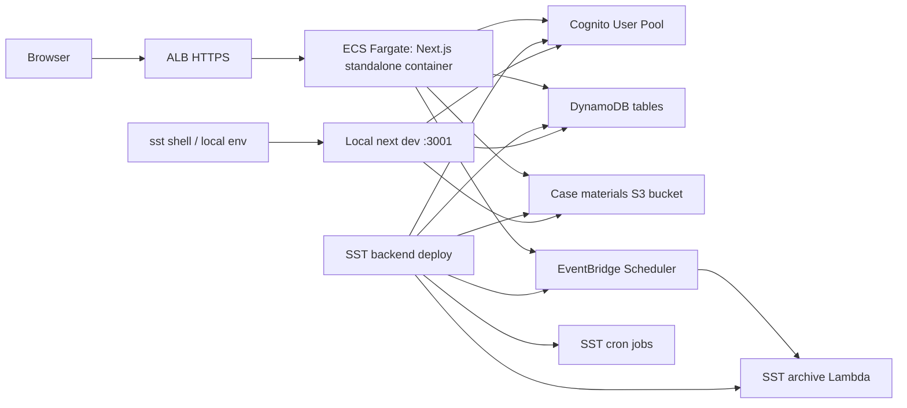

# Next.js Outside SST Migration Runbook

## Purpose

This runbook describes how to move the deployed Next.js web app away from
`sst.aws.Nextjs` while keeping the rest of the AWS resources managed by SST.

The immediate reason is that SST `4.17.x` blocks `sst.aws.Nextjs`/`SsrSite`
deployments in `me-central-1`. The target architecture keeps the backend
resources in `me-central-1` and deploys Next.js as a normal AWS-hosted web
service.

This is a design and migration guide. It does not require changing local
development to a worse workflow; local Next.js should still connect to live SST
resources, even when the `next dev` process runs outside `sst dev`.

## Definition Of "Outside SST"

For this repo, "outside SST" means:

- Do not use `sst.aws.Nextjs` for deployed staging or production web hosting.
- Keep SST as the source of truth for backend AWS resources.
- Keep SST for local resource linking.
- Run local Next.js outside `sst dev`, either through `sst shell` or through an
  explicit local env file with the same resource contract.
- Deploy the web app as a container to AWS, preferably ECS Fargate in
  `me-central-1`.

This preserves the repo rule that AWS infrastructure should be defined through
SST where practical, while avoiding the specific SST SSR-site component that
blocks `me-central-1`.

## Current State

Today `sst.config.ts` imports these modules:

```ts
await import("./infra/auth");
await import("./infra/case-materials");
await import("./infra/secrets");
await import("./infra/tables");
await import("./infra/case-archive");
await import("./infra/jobs");
await import("./infra/nextjs-client");
```

`infra/nextjs-client.ts` currently does three jobs:

1. Starts local Next.js during `sst dev`.
2. Links SST resources into the Next.js runtime through `Resource`.
3. Deploys the production/staging Next.js app through `sst.aws.Nextjs`.

The migration splits those responsibilities:

| Responsibility | Current owner | Target owner |
| --- | --- | --- |
| Backend AWS resources | SST | SST |
| Local Next.js dev command | `sst.aws.Nextjs` | Standalone `next dev` |
| Local resource links | `sst.aws.Nextjs.link` | `sst shell` or explicit local env |
| Deployed web hosting | `sst.aws.Nextjs` | ECS Fargate container |
| Runtime config in deployed web app | SST `Resource` injection | Explicit env vars/secrets |

## Target Architecture



## Migration Principles

- Keep backend resources deployed with `bunx sst deploy --stage <stage>`.
- Remove only the deployed Next.js hosting path from `sst.aws.Nextjs`.
- Preserve fast local `next dev` behavior.
- Make the web runtime contract explicit through environment variables.
- Keep `Resource.*` support for `sst shell` and SST-managed Lambda code.
- Do not require local Docker for normal feature development.

## Runtime Environment Contract

The ECS-hosted Next.js app needs the values that `sst.aws.Nextjs.link` currently
injects.

Use these environment variable names for the deployed web runtime:

| Variable | Source | Secret? | Used for |
| --- | --- | --- | --- |
| `AUTH_USER_POOL_ID` | SST Cognito user pool output | No | Cognito auth operations |
| `AUTH_USER_POOL_CLIENT_ID` | SST Cognito user pool client output | No | Cognito auth operations |
| `CASE_MATERIAL_BUCKET_NAME` | SST S3 bucket output | No | Upload/download case materials |
| `REGISTRATION_WORKFLOW_TABLE_NAME` | SST DynamoDB output | No | Registration workflow data |
| `USER_PROFILE_TABLE_NAME` | SST DynamoDB output | No | User profile/session data |
| `TEACHER_CASE_TABLE_NAME` | SST DynamoDB output | No | Teacher case data |
| `STUDENT_CERTIFICATE_TABLE_NAME` | SST DynamoDB output | No | Certificate data |
| `STUDENT_CASE_COMPLETION_TABLE_NAME` | SST DynamoDB output | No | Completion data |
| `STUDENT_QUIZ_ATTEMPT_TABLE_NAME` | SST DynamoDB output | No | Quiz attempts |
| `CASE_ARCHIVE_SCHEDULE_GROUP_NAME` | SST scheduler config | No | EventBridge schedule group |
| `CASE_ARCHIVE_SCHEDULE_NAME` | SST scheduler config | No | EventBridge schedule name |
| `CASE_ARCHIVE_SCHEDULER_ROLE_ARN` | SST IAM role output | No | Scheduler target role |
| `CASE_ARCHIVE_TARGET_ARN` | SST archive Lambda output | No | Scheduler target Lambda |
| `BETTER_AUTH_SECRET` | GitHub Environment or AWS secret | Yes | Better Auth signing secret |
| `RESEND_API_KEY` | GitHub Environment or AWS secret | Yes | Resend email API |
| `ECCS_EMAIL_SENDER` | GitHub Environment variable | No | Transactional email sender |
| `BETTER_AUTH_URL` | GitHub Environment variable | No | Auth base URL |
| `NEXT_PUBLIC_APP_URL` | GitHub Environment variable | No | Public app URL |
| `AWS_REGION` | GitHub Environment variable | No | AWS SDK default region |
| `AWS_DEFAULT_REGION` | GitHub Environment variable | No | AWS SDK fallback region |

For staging in `me-central-1`, both AWS region vars should be:

```text
AWS_REGION=me-central-1
AWS_DEFAULT_REGION=me-central-1
```

For local Next.js development outside `sst dev`, set the region explicitly in
the process that starts `next dev`. Do not rely only on the AWS profile's
configured region.

```text
AWS_PROFILE=<your-local-aws-profile>
AWS_REGION=us-east-2
AWS_DEFAULT_REGION=us-east-2
AWS_SDK_LOAD_CONFIG=1
```

`AWS_REGION` is the main value used by AWS SDK clients in the Next.js process.
`AWS_DEFAULT_REGION` is kept alongside it for AWS CLI compatibility and older
tooling. `AWS_SDK_LOAD_CONFIG=1` lets SDK code read shared AWS config/profile
settings if a developer accidentally omits an explicit region, but the local
workflow should still set `AWS_REGION` directly.

SST backend deployment can continue to use the AWS profile region when
`providers.aws.region` is omitted from `sst.config.ts`. Plain `next dev` is a
different process, so it should receive the region as environment.

## Test Terminology

The existing memory Playwright suite is an integration/regression suite, not the
deployed-environment smoke test referred to later in this runbook.

| Test type | Typical command | Target | Purpose |
| --- | --- | --- | --- |
| Memory integration tests | `AUTH_E2E_MODE=memory bunx playwright test` | Local in-memory auth harness | Fast PR validation without live AWS dependencies |
| Deployed smoke tests | Future smoke command against `NEXT_PUBLIC_APP_URL` | Staging or production URL | Confirm the deployed web app, runtime env, IAM, and live AWS resources work together |

Staging deployment should eventually run deployed smoke tests after ECS service
stability. PR checks should keep running the memory integration suite.

## Phase 1: Extract A Shared Web Runtime Contract

Create a new module that groups the resources and environment values needed by
the web runtime.

Suggested file:

```text
infra/web-runtime.ts
```

Suggested shape:

```ts
const auth = await import("./auth");
const caseArchive = await import("./case-archive");
const caseMaterials = await import("./case-materials");
const secrets = await import("./secrets");
const tables = await import("./tables");

export const webRuntimeLinks = [
  auth.userPool,
  auth.userPoolClient,
  caseMaterials.caseMaterialBucket,
  secrets.betterAuthSecret,
  secrets.resendApiKey,
  tables.registrationWorkflowTable,
  tables.userProfileTable,
  tables.teacherCaseTable,
  tables.studentCertificateTable,
  tables.studentCaseCompletionTable,
  tables.studentQuizAttemptTable,
];

export const webRuntimeEnvironment = {
  AUTH_E2E_MODE: process.env.AUTH_E2E_MODE ?? "",
  BETTER_AUTH_URL:
    process.env.BETTER_AUTH_URL ??
    process.env.NEXT_PUBLIC_APP_URL ??
    "http://localhost:3001",
  CASE_ARCHIVE_SCHEDULE_GROUP_NAME:
    caseArchive.activeCaseArchiveScheduleGroupName,
  CASE_ARCHIVE_SCHEDULE_NAME: caseArchive.activeCaseArchiveScheduleName,
  CASE_ARCHIVE_SCHEDULER_ROLE_ARN: caseArchive.archiveSchedulerRoleArn,
  CASE_ARCHIVE_TARGET_ARN: caseArchive.archiveFunction.arn,
  NEXT_PUBLIC_APP_URL:
    process.env.NEXT_PUBLIC_APP_URL ?? "http://localhost:3001",
};

export const webRuntimeSchedulerPermissions = [
  {
    actions: ["scheduler:CreateSchedule", "scheduler:UpdateSchedule"],
    resources: [caseArchive.activeCaseArchiveScheduleArn],
  },
  {
    actions: ["iam:PassRole"],
    resources: [caseArchive.archiveSchedulerRoleArn],
    conditions: [
      {
        test: "StringEquals",
        variable: "iam:PassedToService",
        values: ["scheduler.amazonaws.com"],
      },
    ],
  },
];
```

This reduces duplication between local dev linking, ECS task role permissions,
and any future deployment automation.

## Phase 2: Decouple Local Next.js From `sst dev`

Do not replace `sst.aws.Nextjs` with `sst.x.DevCommand` if the chosen local
workflow is to run the Next.js dev server outside `sst dev`.

Instead, keep SST as the local resource context and run Next.js as a separate
process.

Preferred local command:

```sh
AWS_PROFILE=<your-local-aws-profile> \
AWS_REGION=us-east-2 \
AWS_DEFAULT_REGION=us-east-2 \
AWS_SDK_LOAD_CONFIG=1 \
bunx sst shell --stage <local-stage> -- bunx next dev -p 3001
```

Replace `<your-local-aws-profile>` and `<local-stage>` with each developer's
own AWS profile and personal SST stage.

This keeps the Next.js server outside `sst dev`, while still allowing code that
uses `Resource.*` to resolve SST-managed backend resources.

Fully plain local command:

```sh
AWS_PROFILE=<your-local-aws-profile> \
AWS_REGION=us-east-2 \
AWS_DEFAULT_REGION=us-east-2 \
AWS_SDK_LOAD_CONFIG=1 \
bunx next dev -p 3001
```

Only use the fully plain command after `.env.local` contains every non-secret
runtime value from the contract table and the required local secrets. The plain
command does not get SST `Resource.*` injection automatically.

Then update `sst.config.ts` so deployed stages do not import
`infra/nextjs-client.ts`.

Suggested target:

```ts
export default $config({
  app(input) {
    return {
      name: "eccs-ai",
      home: "aws",
      removal: input?.stage === "production" ? "retain" : "remove",
      protect: input?.stage === "production",
    };
  },
  async run() {
    await import("./infra/auth");
    await import("./infra/case-materials");
    await import("./infra/secrets");
    await import("./infra/tables");
    await import("./infra/case-archive");
    await import("./infra/jobs");
  },
});
```

After this change:

- Local Next.js runs as a separate `next dev` process.
- `sst shell` can provide SST resource bindings for local development.
- `sst deploy` no longer evaluates or deploys `sst.aws.Nextjs`.
- The deployed backend resources can use `me-central-1`.

Keep `infra/nextjs-client.ts` until the migration is verified, then delete it.

## Phase 3: Make Web Runtime Config Env-First

The deployed ECS container will not receive SST `Resource.*` values unless it is
run inside an SST-linked component. Update `src/lib/aws/resources.ts` so web
runtime values are resolved in this order:

1. E2E in-memory values when `AUTH_E2E_MODE=memory`.
2. Explicit environment variables.
3. SST `Resource.*` values for `sst shell` and SST Lambda usage.

Example helper:

```ts
function envOrLinked(
  envName: string,
  readLinked: () => string | undefined,
  label: string,
) {
  return required(process.env[envName] ?? linkedValue(readLinked), label);
}
```

Example conversions:

```ts
userPoolId: e2eMode
  ? "e2e-auth-user-pool"
  : envOrLinked(
      "AUTH_USER_POOL_ID",
      () => linkedResources.AuthUserPool?.id,
      "AUTH_USER_POOL_ID or AuthUserPool.id",
    ),
```

```ts
caseMaterialBucketName: e2eMode
  ? "e2e-case-material-bucket"
  : envOrLinked(
      "CASE_MATERIAL_BUCKET_NAME",
      () => linkedResources.CaseMaterialBucket?.name,
      "CASE_MATERIAL_BUCKET_NAME or CaseMaterialBucket.name",
    ),
```

Do this for every value in the runtime environment contract table.

Do not remove the `Resource.*` fallback. It is what keeps `sst shell` local
development and SST Lambda functions working without hand-maintained
`.env.local` files.

## Phase 4: Make AWS SDK Region Explicit

The web container should run in `me-central-1`, so the default SDK region should
work. Still, make the region explicit to avoid future cross-region surprises.

Create a small helper:

```text
src/lib/aws/client-config.ts
```

Suggested shape:

```ts
export function awsClientConfig() {
  const region = process.env.AWS_REGION ?? process.env.AWS_DEFAULT_REGION;
  return region ? { region } : {};
}
```

Then update default clients:

```ts
new DynamoDBClient(awsClientConfig())
new CognitoIdentityProviderClient(awsClientConfig())
new S3Client(awsClientConfig())
new SchedulerClient(awsClientConfig())
```

Scripts already use `AWS_REGION ?? AWS_DEFAULT_REGION`; keep that behavior.

## Phase 5: Enable Next.js Standalone Output

Update:

```text
next.config.ts
```

Add:

```ts
output: "standalone",
```

The config should become:

```ts
import type { NextConfig } from "next";

const nextConfig: NextConfig = {
  output: "standalone",
  reactStrictMode: true,
  turbopack: {
    root: process.cwd(),
  },
};

export default nextConfig;
```

Next.js standalone output emits `.next/standalone/server.js`. Static assets must
be copied into the standalone folder after build:

```sh
cp -R public .next/standalone/public
mkdir -p .next/standalone/.next
cp -R .next/static .next/standalone/.next/static
```

## Phase 6: Add A Web Container Image

Add a Dockerfile for the web runtime.

Suggested file:

```text
Dockerfile.web
```

Suggested shape:

```Dockerfile
FROM oven/bun:1.3.10 AS deps
WORKDIR /app
COPY package.json bun.lock ./
RUN bun install --frozen-lockfile

FROM oven/bun:1.3.10 AS builder
WORKDIR /app
COPY --from=deps /app/node_modules ./node_modules
COPY . .
RUN bun run build
RUN cp -R public .next/standalone/public
RUN mkdir -p .next/standalone/.next
RUN cp -R .next/static .next/standalone/.next/static

FROM node:24-slim AS runner
WORKDIR /app
ENV NODE_ENV=production
ENV PORT=3000
ENV HOSTNAME=0.0.0.0
COPY --from=builder /app/.next/standalone ./
EXPOSE 3000
CMD ["node", "server.js"]
```

Validation commands:

```sh
docker build -f Dockerfile.web -t eccs-ai-web:local .
docker run --rm -p 3000:3000 --env-file .env.local eccs-ai-web:local
```

The Docker runtime is for deployment parity. Normal local feature development
should continue to use `next dev`, preferably launched through `sst shell` so
the app can resolve SST resource bindings.

## Phase 7: Provision AWS Web Hosting

Preferred AWS target for `me-central-1`:

- ECR repository
- ECS cluster
- ECS Fargate service
- Application Load Balancer
- CloudWatch log group
- ECS task execution role
- ECS task role

App Runner is not recommended for this region because the AWS App Runner
endpoint list does not include `me-central-1`.

There are two implementation paths.

### Path A: Keep Web Infrastructure In SST, But Not `sst.aws.Nextjs`

This keeps repo IaC consistent while avoiding the blocked component.

Use SST/raw AWS resources or SST ECS components to define:

```text
infra/web-hosting.ts
```

The web app is still a normal container, not `sst.aws.Nextjs`.

Required ECS task role permissions:

- DynamoDB read/write access to the app tables and indexes.
- Cognito user pool admin/auth actions used by `src/lib/aws/cognito.ts`.
- S3 read/write/delete access to the case material bucket.
- EventBridge Scheduler `CreateSchedule` and `UpdateSchedule`.
- `iam:PassRole` for the archive scheduler role with
  `iam:PassedToService = scheduler.amazonaws.com`.
- SSM/Secrets Manager read access if runtime config is stored there.

This path can also use `sst.Linkable.env(webRuntimeLinks)` for SST-managed
container resources, but the app should still support explicit env vars so the
runtime contract is portable.

### Path B: Create ECS Infrastructure Outside SST

Use this only if the team explicitly wants no SST-owned web hosting resources.

In that case:

- Create ECR/ECS/ALB resources manually or through a separate approved IaC path.
- Keep the ECS task role permissions equivalent to Path A.
- Store the runtime environment contract in GitHub Environment variables,
  SSM Parameter Store, or Secrets Manager.
- Keep SST responsible only for backend resource creation.

This path creates more operational surface area because the repo now has two
infrastructure ownership models.

## Phase 8: Publish Web Runtime Values For ECS

Choose one of these approaches.

### Recommended: SSM Parameter Store For Non-Secrets

Have SST write non-secret runtime outputs to deterministic SSM parameters:

```text
/eccs-ai/{stage}/web/AUTH_USER_POOL_ID
/eccs-ai/{stage}/web/AUTH_USER_POOL_CLIENT_ID
/eccs-ai/{stage}/web/CASE_MATERIAL_BUCKET_NAME
/eccs-ai/{stage}/web/REGISTRATION_WORKFLOW_TABLE_NAME
/eccs-ai/{stage}/web/USER_PROFILE_TABLE_NAME
/eccs-ai/{stage}/web/TEACHER_CASE_TABLE_NAME
/eccs-ai/{stage}/web/STUDENT_CERTIFICATE_TABLE_NAME
/eccs-ai/{stage}/web/STUDENT_CASE_COMPLETION_TABLE_NAME
/eccs-ai/{stage}/web/STUDENT_QUIZ_ATTEMPT_TABLE_NAME
/eccs-ai/{stage}/web/CASE_ARCHIVE_SCHEDULE_GROUP_NAME
/eccs-ai/{stage}/web/CASE_ARCHIVE_SCHEDULE_NAME
/eccs-ai/{stage}/web/CASE_ARCHIVE_SCHEDULER_ROLE_ARN
/eccs-ai/{stage}/web/CASE_ARCHIVE_TARGET_ARN
```

Store secrets separately:

```text
/eccs-ai/{stage}/web/BETTER_AUTH_SECRET
/eccs-ai/{stage}/web/RESEND_API_KEY
```

Secrets should be injected into ECS as ECS secrets, not plaintext task
definition environment values.

### Acceptable Short-Term: GitHub Actions Task Definition Injection

After `sst deploy`, a GitHub Actions step can resolve SST outputs and render an
ECS task definition.

This is faster to implement but harder to audit. Prefer SSM/Secrets Manager
once the deployment path stabilizes.

## Phase 9: Update GitHub Actions Deployment Sequence

The staging workflow should become:

1. Validate GitHub Environment configuration.
2. Configure AWS OIDC credentials for `me-central-1`.
3. Install dependencies.
4. Deploy backend resources:

   ```sh
   bunx sst deploy --stage staging
   ```

5. Build and push the web image:

   ```sh
   docker build -f Dockerfile.web -t "$IMAGE_URI" .
   docker push "$IMAGE_URI"
   ```

6. Register a new ECS task definition revision with:

   - Image URI
   - runtime env vars
   - ECS secrets
   - task role ARN
   - execution role ARN

7. Update the ECS service:

   ```sh
   aws ecs update-service \
     --cluster eccs-ai-staging \
     --service eccs-ai-staging-web \
     --task-definition "$TASK_DEFINITION_ARN" \
     --force-new-deployment
   ```

8. Wait for service stability:

   ```sh
   aws ecs wait services-stable \
     --cluster eccs-ai-staging \
     --services eccs-ai-staging-web
   ```

9. Run deployed smoke tests against `NEXT_PUBLIC_APP_URL` with
   `AUTH_E2E_MODE` unset. These are not the memory integration tests.

## Phase 10: Preserve Local Development

Normal local development runs Next.js outside `sst dev`:

```sh
bun run dev
```

Recommended behavior under the hood:

```sh
AWS_PROFILE=<your-local-aws-profile> \
AWS_REGION=us-east-2 \
AWS_DEFAULT_REGION=us-east-2 \
AWS_SDK_LOAD_CONFIG=1 \
bunx sst shell --stage <local-stage> -- bunx next dev -p 3001
```

Expected behavior after migration:

- The personal/local SST stage already exists or is deployed separately.
- Local Next.js runs as a normal `next dev` process.
- When launched through `sst shell`, local Next.js receives `Resource.*`
  bindings from SST.
- When launched without `sst shell`, local Next.js must receive every runtime
  value from `.env.local`.
- Local Next.js always receives explicit Ohio region values:
  `AWS_REGION=us-east-2` and `AWS_DEFAULT_REGION=us-east-2`.
- Developers do not need Docker for normal feature work.
- Developers should not run plain `bunx next dev` unless `.env.local` provides
  every runtime env var manually.

Plain command for one-off local debugging after `.env.local` is complete:

```sh
AWS_PROFILE=<your-local-aws-profile> \
AWS_REGION=us-east-2 \
AWS_DEFAULT_REGION=us-east-2 \
AWS_SDK_LOAD_CONFIG=1 \
bunx next dev -p 3001
```

This is useful when debugging outside SST entirely, but it should not be the
default unless the local env file is intentionally maintained.

## Phase 11: Update Scripts

Update local scripts so `bun run dev` starts Next.js outside `sst dev` while
still setting the local region explicitly:

```json
"dev": "AWS_REGION=us-east-2 AWS_DEFAULT_REGION=us-east-2 AWS_SDK_LOAD_CONFIG=1 bunx sst shell --stage <local-stage> -- bunx next dev -p 3001",
"dev:e2e": "AUTH_E2E_MODE=memory AWS_REGION=us-east-2 AWS_DEFAULT_REGION=us-east-2 bunx next dev -p 3001"
```

Replace `<local-stage>` before committing an actual script change, or use a
developer-specific wrapper that supplies the stage name.

Keep the Playwright memory suite separate from deployed smoke tests:

```json
"test:e2e:memory": "AUTH_E2E_MODE=memory bunx playwright test"
```

Add deployment-oriented scripts only after the Dockerfile exists:

```json
"build:web": "bun run build",
"docker:build:web": "docker build -f Dockerfile.web -t eccs-ai-web:local ."
```

Do not replace `bun run dev` with Docker. That would make local development
slower and would make routine feature work heavier than necessary.

## Phase 12: Remove `sst.aws.Nextjs`

Once local `sst shell` development works and ECS deploys are working:

1. Stop importing `infra/nextjs-client.ts` in deployed stages.
2. Keep the file for one release as rollback reference.
3. Delete it after staging has deployed successfully through ECS.
4. Remove any workflow assumptions that `sst deploy` deploys the web app.

Rollback is simple before deletion:

```ts
await import("./infra/nextjs-client");
```

But rollback only works in regions supported by `sst.aws.Nextjs`; it will not
fix `me-central-1`.

## Verification Checklist

Local checks:

```sh
bun run lint
bun run test
bun run build
AWS_REGION=us-east-2 AWS_DEFAULT_REGION=us-east-2 AWS_SDK_LOAD_CONFIG=1 bunx sst shell --stage <local-stage> -- bunx next dev -p 3001
```

Manual local verification:

- Open `http://localhost:3001`.
- Register/login against the local SST stage.
- Upload and download a case material.
- Publish a case with an archive deadline.
- Trigger password reset email path if Resend credentials are configured.

Container checks:

```sh
docker build -f Dockerfile.web -t eccs-ai-web:local .
docker run --rm -p 3000:3000 --env-file .env.local eccs-ai-web:local
```

Staging checks:

- `bunx sst deploy --stage staging` succeeds in `me-central-1`.
- ECS service reaches stable state.
- ALB health check passes.
- Deployed smoke tests pass against staging URL with `AUTH_E2E_MODE` unset.
- CloudWatch logs show no missing env/resource errors.
- Cognito/DynamoDB/S3/Scheduler calls target `me-central-1`.

## Rollback Plan

If ECS deployment fails before traffic moves:

1. Keep the previous ECS task definition active.
2. Fix task env, task role, or image issue.
3. Redeploy ECS only.

If ECS deployment succeeds but smoke tests fail:

1. Roll ECS service back to the previous task definition revision.
2. Leave SST backend resources untouched.
3. Inspect missing env var or IAM denial in CloudWatch logs.

If local dev fails:

1. Temporarily re-import `infra/nextjs-client.ts` only under `$dev`.
2. Continue using `sst.aws.Nextjs` for local dev while ECS migration proceeds.
3. Do not re-enable `sst.aws.Nextjs` in deployed `me-central-1` stages.

## Done Criteria

The migration is complete when:

- `sst deploy --stage staging` no longer evaluates `sst.aws.Nextjs`.
- Backend resources deploy to `me-central-1`.
- Next.js runs on ECS Fargate in `me-central-1`.
- The ECS task role can access all required backend resources.
- Local `bun run dev` starts Next.js outside `sst dev` with explicit Ohio region
  values.
- Web runtime config is explicit and documented.
- Staging deploys automatically after PR checks and merge to `staging`.
- Smoke tests pass against the ECS-hosted staging URL.
